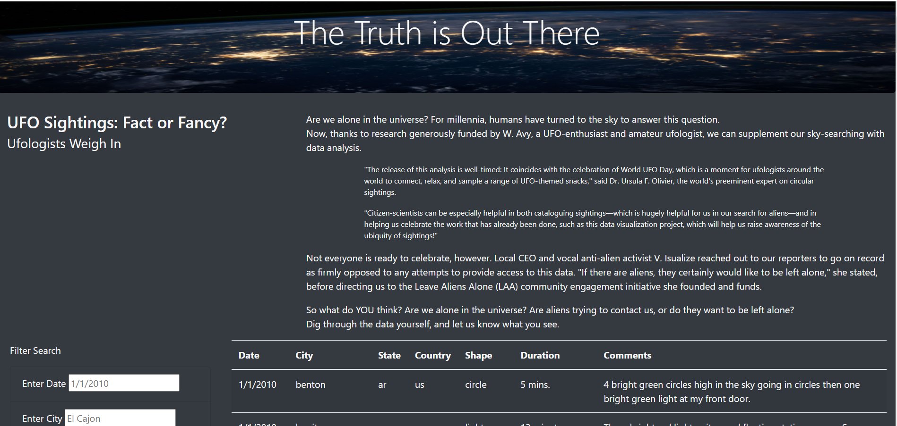
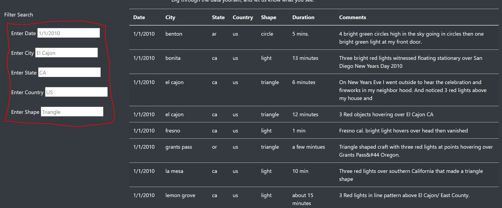

# UFOs
## Introduction
UFO’s! This project is on behalf of Dana, whom would like to make a dynamic web page to provide in-depth analysis of UFO sightings. **How to do this? Well, JavaScript and HTML are the answers. This project uses both of the former programs to create a web page that can be filtered by city, state, country, and shape.** 
## Results
Below are examples of what the web page appears as when you enter it.  The first image is the introduction to the page which gives background on UFO’s and what the page was created for. The second image is the dynamic portion of the page. This portion is able to be filtered by city, state, country, and shape. Once the filters are applied, the out put is shown on the right side of the page adjacent to the filters. 

## Summary
While the web page is super user friendly, there are a few drawbacks . The major draw back is that the filter fields do not provide suggested possible field category that correlate to what you’re typing in to the field. To fix this I have two recommendations. First, apply a suggested autofill feature to make the process faster. Second and lastly, provide a drop down menu so that the possible field options can be easily viewed. 
